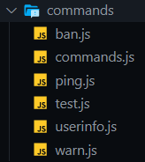
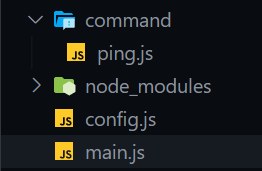

# Discord-command.js

<p>
<a href="https://www.npmjs.com/package/discord-command.js"></a>
<a href="https://www.npmjs.com/package/discord-command.js"></a>
</p>

This package is a command manager for your discord bot
Developped for [Discord.js](https://discord.js.org/)

# Example Usage

## Import

```javascript
import { Command, Commands } from "discord-command.js";

// or

const { Command, Commands } = require("discord-command.js");
```

## Command manager

The command manager is here for manage a lot of commands with a beautiful 💖 directory 💖 like so:



But, before use the command manager you need to configure it.

```javascript
Commands.setConfig({ prefix: "-", commandsPath: "your_file_path" });
```

and `Commands.load()` for load all commands in the cache if you use the command manager

**warning:** the `commandsPath` option has to be from the directory where is the `node_modules` file



so the `commandsPath` gonna be `./command` in _main.js_

## Commands

> use the command manager

```javascript
bot.on("message", message => Commands.onMessage(message, bot));
```

> or you just can use the inside **parser**

```javascript
bot.("message", message => {
    const [command, arguments] = Command.parse(message);

    if(command === "!ping") {
        message.reply("pong");
    }
})
```

## Creating command

> put commands files in a directory,
> the directory path has to be the same than in the configuration of Commands <br/>
> (**only relative paths works**)

```javascript
const { Command } = require("discord-command.js");
const { performance } = require("perf_hooks");

module["exports"] = new Command(
	// name
	"ping",
	// description
	"get the response time between you and the bot",
	// the function that gonna be executed
	async (message, args, bot) => {
		const t0 = performance.now();
		const msg = await message.channel.send(`Pong !`);
		msg.edit(`Pong !*(${Math.floor(performance.now() - t0)}ms)*`);
	},
);
```

> or

```javascript
const { Command, Commands } = require("discord-command.js");

Commands.add(
	new Command("ping", null, (message, args, bot) => {
		message.reply("Pong!");
	}),
);
```

# For advenced commands

> For create advenced commands you can add a **description**, a **documentation**, and some **options/childrens** to a command

### **_Description:_**
