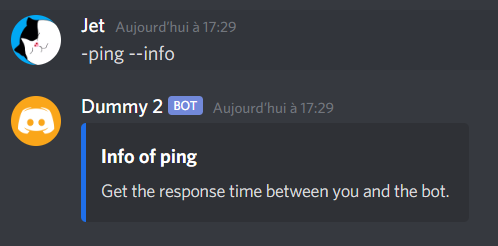
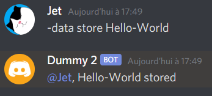

# Discord-command.js

<p>


</p>

This package is a command manager for your discord bot
Developped for [Discord.js](https://discord.js.org/)

# Example Usage

## Import

```javascript
import { Command, Commands } from "discord-command.js";

// or

const { Command, Commands } = require("discord-command.js");
```

## Command manager

The command manager is here for manage a lot of commands with a beautiful 💖 directory 💖 like so:


But, before use the command manager you need to configure it.

```javascript
Commands.setConfig({ prefix: "-", commandsPath: "your_file_path" });
```

and `Commands.load()` for load all commands in the cache if you use the command manager

**warning:** the `commandsPath` option has to be from the directory where is the `node_modules` file


so the `commandsPath` gonna be `./command` in _main.js_

## Commands

> use the command manager

```javascript
bot.on("message", (message) => Commands.onMessage(message, bot));
```

> or you just can use the inside **parser**

```javascript
bot.("message", message => {
    const [command, arguments] = Command.parse(message);

    if(command === "!ping") {
        message.reply("pong");
    }
})
```

## Creating command

> put commands files in a directory,
> the directory path has to be the same than in the configuration of Commands <br/>
> (**only relative paths works**)

```javascript
const { Command } = require("discord-command.js");
const { performance } = require("perf_hooks");

module["exports"] = new Command(
	// name
	"ping",
	// description
	"get the response time between you and the bot",
	// the function that gonna be executed
	async (message, args, bot) => {
		const t0 = performance.now();
		const msg = await message.channel.send(`Pong !`);
		msg.edit(`Pong !*(${Math.floor(performance.now() - t0)}ms)*`);
	}
);
```

> or

```javascript
const { Command, Commands } = require("discord-command.js");

Commands.add(
	new Command("ping", null, (message, args, bot) => {
		message.reply("Pong!");
	})
);
```

# For advenced commands

> For create advenced commands you can add a **description** and **options/childrens** to a command

### **_Description:_**

Useful if the you put `--info` after a command



### **_Options / childrens:_**

If you want to create some command with different options/childrens/branch.
Imagine that you want to create a command that gonna save a value, but with only one command.
You can do it like so:

```javascript
const { Command } = require("../src/command");
const fs = require("fs");

// for store data
const store = new Command("store", null, (message, args, bot) => {
	const data = args[1];
	fs.writeFileSync("./data.json", JSON.stringify(data));
	message.reply(`${data} stored!`);
});

// show the stored data
const show = new Command(["show", "shw"], null, (message, args, bot) => {
	message.reply(`${fs.readFileSync("./data.json")} was stored!`);
});

// and you juste have to export this command

module["exports"] = new Command("data", null, null, [show, store] /* options */);
```

### Result:




# Extra helps

Are additional aids included automatically in the commands, like if you want get the info of a command, you just had to type `your_command --info`:


you can change that in the configuration of the bot

```javascript
Commands.setConfig({ extraHelps: true, info: "!info" });
```

by default, `extraHelps` is set to true and `info` is set to --info, in future version the documentation options gonna be useful.
